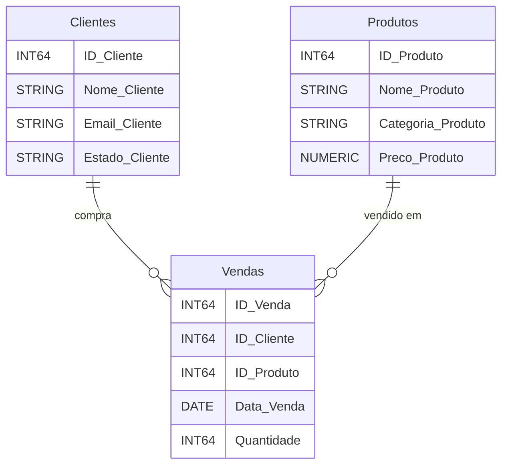

# Mini Projeto — Pipeline de Dados e Análise com SQL no BigQuery (Livraria DevSaber)

## 🎯 Objetivo
Transformar uma planilha de vendas em um mini *data warehouse* no **Google BigQuery**, criando tabelas, ingerindo dados, analisando com `SELECT/JOIN/GROUP BY` e publicando uma **VIEW** reutilizável.

## 🗂️ Estrutura do repositório
```
.
├─ 01_create_tables_bigquery.sql
├─ 02_insert_data_bigquery.sql
├─ 03_analysis_and_view_bigquery.sql
└─ README.md
```

## 🚀 Como executar
1. Crie um **Dataset** no BigQuery (ex.: `dw_devsaber`).
2. Substitua todas as ocorrências de ``seu-projeto.seu_dataset`` pelo seu `project.dataset` (ex.: ``meu-projeto.dw_devsaber``).
3. Rode os arquivos nesta ordem:
   - `01_create_tables_bigquery.sql`
   - `02_insert_data_bigquery.sql`
   - `03_analysis_and_view_bigquery.sql`
4. Teste a VIEW:
   ```sql
   SELECT *
   FROM `seu-projeto.seu_dataset.v_relatorio_vendas_detalhado`
   ORDER BY Data_Venda;
   ```

## 🧩 Modelo de Dados (lógico)


## ❓ Perguntas de negócio e respostas (com SQL)

### 1) Clientes do estado de **SP**
```sql
SELECT Nome_Cliente
FROM `seu-projeto.seu_dataset.Clientes`
WHERE Estado_Cliente = 'SP';
```
**Resposta (com os dados de exemplo):** Ana Silva, Carla Dias.

### 2) Produtos da categoria **Ficção Científica**
```sql
SELECT Nome_Produto
FROM `seu-projeto.seu_dataset.Produtos`
WHERE Categoria_Produto = 'Ficção Científica';
```
**Resposta:** Duna, O Guia do Mochileiro.

### 3) Listar vendas com **cliente, produto e data** (ordenado por data)
```sql
SELECT C.Nome_Cliente, P.Nome_Produto, V.Data_Venda
FROM `seu-projeto.seu_dataset.Vendas` V
JOIN `seu-projeto.seu_dataset.Clientes` C ON V.ID_Cliente = C.ID_Cliente
JOIN `seu-projeto.seu_dataset.Produtos` P ON V.ID_Produto = P.ID_Produto
ORDER BY V.Data_Venda;
```

### 4) **Valor total** de cada venda (`Quantidade * Preco_Produto`)
```sql
SELECT V.ID_Venda, (V.Quantidade * P.Preco_Produto) AS Valor_Total
FROM `seu-projeto.seu_dataset.Vendas` V
JOIN `seu-projeto.seu_dataset.Produtos` P ON V.ID_Produto = P.ID_Produto;
```

### 5) **Produto mais vendido** (por quantidade)
```sql
SELECT P.Nome_Produto, SUM(V.Quantidade) AS Total_Quantidade_Vendida
FROM `seu-projeto.seu_dataset.Vendas` V
JOIN `seu-projeto.seu_dataset.Produtos` P ON V.ID_Produto = P.ID_Produto
GROUP BY P.Nome_Produto
ORDER BY Total_Quantidade_Vendida DESC
LIMIT 1;
```
**Resposta:** *Python para Dados* (total 2 unidades).

## 🔎 View reutilizável
Cria uma visão consolidada para relatórios:
```sql
CREATE OR REPLACE VIEW `seu-projeto.seu_dataset.v_relatorio_vendas_detalhado` AS
SELECT
    V.ID_Venda,
    V.Data_Venda,
    C.Nome_Cliente,
    C.Estado_Cliente,
    P.Nome_Produto,
    P.Categoria_Produto,
    V.Quantidade,
    P.Preco_Produto,
    (V.Quantidade * P.Preco_Produto) AS Valor_Total
FROM `seu-projeto.seu_dataset.Vendas` V
JOIN `seu-projeto.seu_dataset.Clientes` C ON V.ID_Cliente = C.ID_Cliente
JOIN `seu-projeto.seu_dataset.Produtos` P ON V.ID_Produto = P.ID_Produto;
```

**Uso:**
```sql
SELECT *
FROM `seu-projeto.seu_dataset.v_relatorio_vendas_detalhado`
WHERE Estado_Cliente = 'RJ';
```

## 📝 Respostas conceituais (para o README)

- **Por que uma planilha não é ideal?** Falta de controle de versões, validação e integridade; alta propensão a erros manuais; desempenho ruim para volumes grandes; difícil governança e auditoria.
- **Perguntas que o dono quer responder:** receitas por produto/categoria/estado; clientes recorrentes; ticket médio; produtos mais/menos vendidos; sazonalidade de vendas; evolução mensal.
- **Por que inserir clientes/produtos antes de vendas?** Evita duplicidade e garante *dimensões* limpas; a tabela de **Vendas** referencia IDs existentes (dimensional).
- **Em milhões de vendas/dia, `INSERT` é ideal?** Não. Preferir **carga por arquivos** (Cloud Storage + BigQuery Load Jobs), **ingestão em lote** (bq load) ou **streaming** (Storage Write API).
- **Se o BigQuery não tem chaves estrangeiras, como garantir integridade?** Via **processo ETL/ELT**, *constraints* lógicas nas consultas (JOIN por IDs válidos), validações e *tests* de qualidade (ex.: *dbt tests* de `relationships`/`not_null`).
- **Vantagem de usar VIEW:** padroniza a lógica, reduz duplicação e risco de erro, facilita reuso e controle de acesso; sempre reflete os dados **atuais**.
- **Se o preço mudar, a VIEW atualiza o `Valor_Total`?** Sim: a VIEW é materialização lógica da consulta; ao consultar novamente, trará o preço vigente na tabela **Produtos** naquele momento (a menos que você use *snapshots* ou tabelas historizadas de preço).

## ✅ Dicas de entrega (GitHub)
- Confirme o `project.dataset` antes de subir.
- Inclua um print da VIEW ou resultado da consulta no PR.
- Escreva um resumo no README do que você aprendeu.

---

Feito com 💙 para a Livraria DevSaber.
